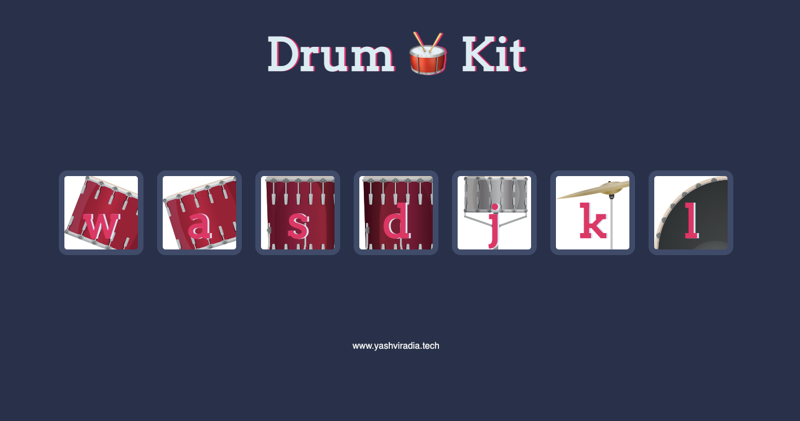

# Drumkit Website

A mini Band made with help of HTML, CSS and Javascript.

## Table of contents
- [Overview](#overview)
  - [Screenshot](#screenshot)
  - [Links](#links)
- [My process](#my-process)
  - [Built with](#built-with)
  - [What I learned](#what-i-learned)
  - [Useful resources](#useful-resources)
- [Author](#author)
- [Acknowledgments](#acknowledgments)

## Overview

### Screenshot

### Links
- Live Site URL: [Drum Kit](https://yashviradia.github.io/drumkit_website/)

## My process

### Built with

- Semantic HTML5 markup
- CSS custom properties
- Flexbox
- CSS Grid
- Javascript Event Listeners

### What I learned
- Using Javascript Event Listeners

### Useful resources
- [Stack Overflow](https://stackoverflow.com/)
- [Google](https://www.google.com/)

## Author
- Website - [Yash Viradia](https://yashviradia.github.io/personal_website_1/)
- Twitter - [@theyashviradia](https://twitter.com/theyashviradia)

## Acknowledgments
- LondonAppBrewery - [LondonAppBrewery](https://www.londonappbrewery.com/)
- Flaticons - [Flaticons](https://www.flaticon.com/)
